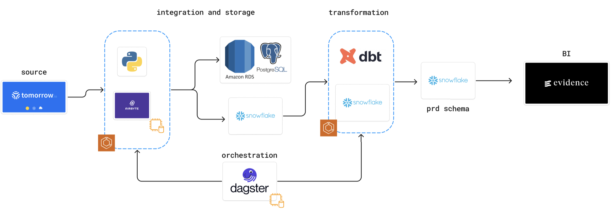

# ETL Project: Weather Data Pipeline

## Table of Contents
- [Use Case](#use-case)
- [Tools Used / Architecture](#tools-used--architecture)
- [How to Deploy into Production](#how-to-deploy-into-production)
- [How to Run Locally](#how-to-run-locally)
- [Future Enhancements](#future-enhancements)

## Use Case
This etl workflow extracts hourly and daily metrics related to the six day forecast of Des Moines, Iowa. Condition related dimensions forecasted by hour like temperature, humidity, precipitationProbability are provided alongisde daily metrics sunsetTime and sunriseTime.

The high level workflow includes:
- Pulls hourly and daily weather data from the tomorrow.io forecast endpoint. It then creates two dataframes from the extracted JSON that are then passed to our RDS postgres database.
- Once in postgres we trigger an airbyte connection that inserts the extracted data into our target OLAP, Snowflake.
- We then run dbt supported transformations that reference our staging data layer and write to our production snowflake schema.
- To orchestrate the endpoint extraction and further transformations we have Dagster trigger our ec2 instance.
- To visualize our 6-day forecast we then deploy an evidence.dev instance to build out basic reporting written in markdown

## Tools Used / Architecture
- **Tomorrow.io API**: Provides weather data that includes hourly and daily forecasts.
- **Python**: The primary programming language used to build the ETL pipeline.
- **PostgreSQL**: The database used to store raw staging data from the forecast endoint.
- **Docker**: Used to containerize the ETL and DBT tasks for deployment.
- **AWS ECS**: Houses our two workflows and manages infrastructure to support future scaling of use case.
- **Dagster**: Orchestrator used to manage the ETL pipeline and schedule tasks.
- **Evidence**: Semantic layer for visualization.



## How to Deploy into Production
1. **Dockerize the ETL and DBT workflow**:
   - Create images of the subfolders for each respective workflow (DBT, ETL). (example dockerfiles in each workflow folder, ensure build architecture of image is compatible with ec2 instance infrastructure)
   - Create Amazon ECR repositories for both workflows and subsequently push the images into their respective repository.
  
### 3. **Set Up AWS Infrastructure**

#### **ECS (Elastic Container Service)**

1. **Create an ECS Cluster:**
   - If you don't already have an ECS cluster, create one. 
   - For this project, we are using Fargate to provide compute resources, which helps avoid overloading the EC2 instance that supports Airbyte and Dagster.

2. **Define a Task Definition:**
   - Create a task definition that references each Docker image you intend to use.
   - Define container override environment variables as needed.

3. **Create Log Groups:**
   - Set up log groups for each task definition to monitor workflow logging during runtime.

#### **EC2 (Elastic Compute Cloud)**

1. **Create an EC2 Instance:**
   - This project uses a t2.large instance type built with the AMD64 architecture.

2. **Define Inbound Rules:**
   - Define inbound rules so that all tools being deployed within the same VPC can communicate with each other.
   - **Note:** Although it is not recommended for security reasons, we have a custom TCP inbound rule allowing traffic for the following port range: 0 - 65535.

#### **Deploying Airbyte to Your EC2 Instance**

1. **Install Docker:**
   - Reference: [Airbyte Documentation for AWS EC2 Deployment](https://docs.airbyte.com/deploying-airbyte/on-aws-ec2)
   - SSH into your EC2 instance or connect via the AWS UI.
   - Run the following commands:

     ```bash
     sudo yum update -y
     sudo yum install -y docker
     ```

2. **Start the Docker Service:**
   - Run the following command to start the Docker service:

     ```bash
     sudo service docker start
     ```

3. **Add the Current User to the Docker Group:**
   - Run the following command to add the current user to the Docker group:

     ```bash
     sudo usermod -a -G docker $USER
     ```

   D) Manually install Docker Compose
   E) Reference: https://docs.docker.com/compose/install/linux/#install-the-plugin-manually
   DOCKER_CONFIG=${DOCKER_CONFIG:-$HOME/.docker}
   mkdir -p $DOCKER_CONFIG/cli-plugins
   curl -SL https://github.com/docker/compose/releases/download/v2.24.2/docker-compose-linux-x86_64 -o $DOCKER_CONFIG/cli-plugins/docker-compose
   chmod +x $DOCKER_CONFIG/cli-plugins/docker-compose
   docker compose version

   F) Logout of the instance
   exit

   G) Download and run Airbyte
   mkdir airbyte && cd airbyte
   wget https://raw.githubusercontent.com/airbytehq/airbyte/master/run-ab-platform.sh
   chmod +x run-ab-platform.sh
   ./run-ab-platform.sh -b

   **Deploying Dagster to your ec2**
   A) SSH or connect via AWS UI and run the following code below
   - Scaffold new dagster project ([taken from here](https://docs.dagster.io/getting-started/create-new-project#step-1-bootstrap-a-new-project)).
   
   **AWS RDS/Postgres**
   - create instance using the latest Postgres engine (16.3)
   - ensure database instance is under the same VPC as your ec2 instance.
   - Optional: create parameter group to enable logical replication for CDC enabled syncs from postgres to snowflake
   
   **Monitor and Scale**:
   - Use CloudWatch to monitor ECS task execution and set up alerts for any issues.
   - Scale the ECS service as needed based on the load and frequency of the ETL runs.


